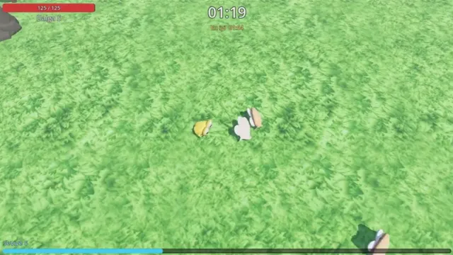

# Hayatta Kal

Yukarıdan bakışlı bir hayatta kalma oyunu. Arbaletin kendi kendine ateş ediyor; sen hareket ediyor, mücevher topluyor, seviye atlıyor ve büyüyen dalgalara karşı güçlendirme seçiyorsun.

Bu oyunu bir YouTube videosu için yaptık. Kodu Godot 4.7'de Claude Code (Opus 5.5) yazdı; bütün modeller, dokular, müzik ve ara sahne videoları [Higgsfield](https://higgsfield.ai/s/claude-opus-5-5-yt-yusufipk-kKcOju) ile üretildi. Videonun linki yayınlanınca buraya eklenecek.

## Oyna

[Releases](https://github.com/yusufipk/hayatta-kal/releases/latest) sayfasından sistemine uygun dosyayı indir ve çalıştır, kurulum gerekmiyor.

- **Windows:** `HayattaKal.exe`. Dosya imzalı olmadığı için SmartScreen uyarı verebilir: "Ek bilgi"ye, sonra "Yine de çalıştır"a tıkla.
- **Linux:** `chmod +x HayattaKal.x86_64 && ./HayattaKal.x86_64`

Vulkan destekleyen bir ekran kartı gerekiyor (Windows'ta Direct3D 12 de yeterli).

## Kontroller

- **WASD** ya da **ok tuşları:** yürü (nişan ve ateş otomatik)
- **1 / 2 / 3:** seviye atlayınca güçlendirme kartı seç
- **Boşluk**, **Enter** ya da **Esc:** girişi geç
- **R:** yeniden başla

## Kaynak koddan çalıştır

`project.godot` dosyasını [Godot 4.7](https://godotengine.org/download) ile aç ve F5'e bas.

## Lisans

Kod MIT lisanslı. `assets/` klasöründeki modeller, dokular, müzik ve videolar bu lisansın kapsamında değil.
